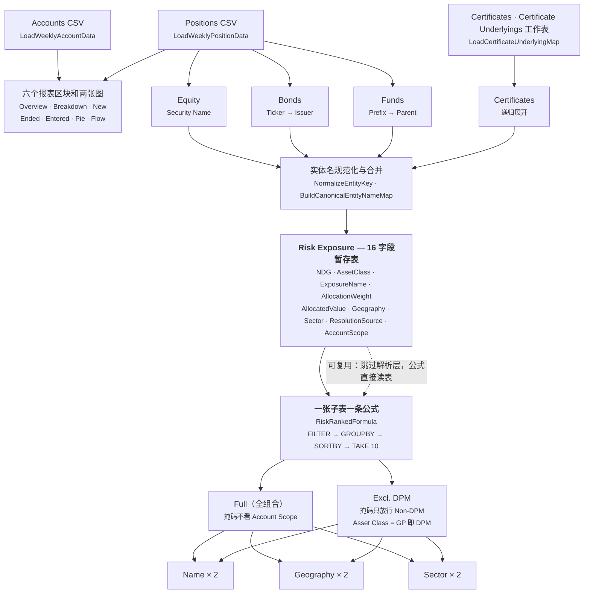

# WeeklyAnalysisGenerate 解读

基于 `src/weekly/WeeklyAnalysisGenerate.bas` 通读整理（13,956 行 / 233 个过程；模块头部的版本注释停在
v82，之后的改动只在 git 记录里）。

这是整个工作簿里最大的模块，也是唯一一个把「读 CSV」当成工程问题的模块。它把每日 Sophis
快照变成一张周度 Lombard 报表，中间经过一张 16 字段的可审计暂存表。

| | |
| --- | --- |
| 行数 | 13,956 |
| 过程数 | 233 |
| 暂存表字段 | 16 |
| 输出集中度表 | 6 张（3 维度 × 2 口径），共 22 个子表 |

---

## 整体形状

入口只有一个：`GenerateWeeklyAnalysis`。它读 `Home!WeeklyEndDate`（报表日期）和
`Home!WeeklyCompareDate`（比较的日期，通常是上一份报表的；缺失、不是日期或不早于报表日期时弹窗
停下），各解析出上月比较日，再加 YTD 日（上年末），加载九份快照数据（两个日期各自的当前和上月，
各一份 Accounts 加一份 Positions，YTD 只要 Positions），然后按 `WeeklyAnalysisLayout.Layout` 里的
坐标把六个区块和两张图写到同一张 *Weekly Analysis* 表上。每张表都把比较日期的数据放在本期旁边，日期列
表头 `As of`，日期本身不带前缀：Active Lombard Loans 是年末、三个月、比较日期（按日期插入）、本期，
没有变化行；Collateral Breakdown 是年末、比较日期、本期各两行（金额、占比），再 `% Change WoW`
（对比较日期）和 `% Change YTD`；New / Ended / Entered 三张 "in the Past Month" 的表各是比较日期
那一行（Entered 是金额加占比两行）、本期的行，最后一行 `% Change WoW` 是两者之差，窗口都是过去
一个月。比例都是公式，分母为 0 或小于半分钱（`ZERO_BASE_TOLERANCE`，分摊留下的零头）显示空白。Overview、New Loans、Loans Ended 三张表在左栏上下叠放，
五列相同（Loans、Approved Loan、Drawn Amount、Collateral Value），Notes 框在它们下面、同样五列宽；
Breakdown 那一栏隔一列空开始，Entered、饼图和贷款流向图在它下面，集中度区块再隔一列空紧接 Breakdown。
Active 和 Breakdown 里当前日期那几行深红底（#943634）白字。

但真正的重量不在报表区块，而在 `BuildRiskGranularitySection` —— 它一个人占了从第 10,980 行
往后的篇幅，加上它依赖的证书展开、实体名规范化和参照表维护，超过全模块的三分之二。

六个报表区块走的是直路：读进来、按资产类别汇总、写出去。写出去的只有金额；Breakdown 和
Entered 里的比例行（% of Portfolio、% Change、%）是引用金额行的公式，除法留给 Excel。饼图和
贷款流向图最后才画：它们按单元格的尺寸定位，得等 AutoFit 和行高都定下来，各画在跟 Notes 同样式
的边框里，流向图在饼图正下方、同样宽。

流向图是一张 Sankey，Excel 没有这种图表，所以 `CreateLoanFlowDiagram` 用形状画：左边是过去一个月
抵押品的减项，上下两个节点——终止的贷款（深红）和留下来的 NDG 里跌了的仓位（橙）；中间一列是八个
抵押品类别；右边是增项——新增贷款（绿）和涨了的仓位（蓝）。左到中的每条带子是一个减项从某个类别
拿走的抵押品，中到右的是一个增项带进来的，宽度按金额、全图一个比例，类别节点取两边较大的那边的
高度，细到看不见的节点画成最小高度再把比例重算一遍；同一侧两个节点喂同一个类别时带子难免交叉，
颜色分得开。类别节点的颜色不是饼图的分类色，而是这个类别本月净变动（进减出）的方向：涨绿、跌红、
没动灰（`FlowNetColor`），只分这三种；标签末尾用同样的颜色写出净变动对上月持仓的百分比，框底
一行小字说明配色。新增和终止的数据就是 Entered 表用的 `EnteredCollateralAmounts`，正着算一次是进来的，
把两个快照和上月的持仓反过来再算一次就是出去的，NDG 集合在 `MovedNdgSet` 里，两张 movement 表数的
也是它；仓位增减在 `ContinuingCollateralChanges` 里：两个快照都有的 NDG，按 NDG × 类别比较本期和
上月的持仓，涨的归 Risen、跌的归 Fallen（半分钱以内不算动），所以一个客户卖股票买债券会在两边各
出现一次。带子是 `BuildFreeform` 的贝塞尔曲线，节点是矩形，标签是无边框文本框（类别名加粗，出去
的金额红色带减号、进来的绿色带加号；侧节点标签是标题和金额，两个贷款节点中间多一行 NDG 数——仓位涨跌的 NDG 数说不清是什么，不写），全部 Group 成一个名为
`LoanFlowSankey` 的形状，邮件像复制饼图一样把它整个复制成一张图。一个月里什么都没动时，框里只写
一句话。左边这条
才是模块的主干——四条解析支路把每一笔持仓变成一到多条「暴露」记录，汇进同一张暂存表，再从那张
表分出两个口径、三个维度。

报表区块用到的八个资产类别集中在 `CollateralCategories()` 一处定义（字典键 + 列标题），
Collateral Breakdown、Entered Collateral、各处合计和饼图切片颜色都从它派生，所以增删一个
类别只改这一个数组。

---

## 为什么这个模块的读取层和别处不一样

其他模块的 CSV 读取是 `Split(txt, ";")` 加 `Val()`。这里不是。三处细节说明作者是被真实
数据咬过的：

**数字解析不用 `CDbl`。** `WeeklyCsvDouble` 先看 `VarType`：已经是数值类型就直接 `CDbl`；
是字符串就自己动手——去掉 €、不换行空格、百分号，识别括号负数和尾随负号，然后**比较最后一个
逗号和最后一个点的位置**来判断哪个是小数点、哪个是千分位，最后才 `Val`。代码里那句注释写得
很直接：不要对 CSV 字符串用 `CDbl`，它是 locale-sensitive 的。换一台区域设置不同的机器，
同一份文件会解析出不同的数字——这个模块是唯一防住了这件事的。

**BOM 按字节值判断。** `CleanWeeklyCsvField` 剥引号、还原双写引号、去 `U+FEFF`，然后再检查
一次开头三个字符的码位是不是 239 / 187 / 191。为什么不直接写 UTF-8 BOM 字符？注释说明了：
这样 VBA 源码本身可以保持 ASCII-safe。二进制读入时 BOM 会以三个 ANSI 字符的形态存活下来，
只能按字节抓。

**列名可以变。** `FindWeeklyHeaderIndex` 接受一组候选表头名（`"Asset Type / Classification"`、
`"Asset Type"`、`"Classification"`），用 `NormalizeHeader` 抹掉空格、下划线、括号、斜杠后
比对；全都找不到就退到一个固定列号；再不行才按 `Required` 决定报错还是返回 −1。Issuer 和
Additional Comment 是 `Required:=False` 的——这两列不在也能跑。

> `WeeklySourceLines` 是先把 CRLF / CR 归一成 LF 再切分的。`CoreUtils.ReadAllLines`
> 后来补上的就是这套写法。

---

## 核心：Risk Exposure 暂存表

整个风险分析的枢纽是一张有名字的中间表，不是内存里的字典。`RiskStageField` 这个 Enum 定义了
16 个字段，每条记录代表**「某个 NDG 的某笔持仓，对某个实体贡献了多少暴露」**。

| 字段 | 作用 |
| --- | --- |
| `SourceRow` | 回溯到 Positions CSV 的原始行号 |
| `ProductISIN` / `SecurityName` / `OriginalAssetType` | 原始持仓身份，未经任何映射 |
| `AssetClass` | 风险口径的资产类别（不同于组合口径，见下） |
| `ExposureName` | 规范化后的最终实体名 |
| `ExposureType` | Equity issuer / Bond issuer / Fund parent company / Certificate underlying … |
| `AllocationWeight` | 这笔持仓分配给该实体的比例。非证书恒为 1 |
| `AllocatedValue` | 持仓市值 × 权重，聚合时实际相加的数 |
| `Geography` / `Sector` | 从 Companies 表解析出来的维度值 |
| `ResolutionSource` | **这个名字是怎么来的** |
| `AccountScope` | `DPM` 或 `Non-DPM`，建行时就定好 |

`ResolutionSource` 是整个设计里最值得称道的一个字段。它记的不是数据，是**数据的来历**：
`"Position: Security Name"`、`"BondIssuers: Issuer Ticker"`、`"UnmappedEquities: ISIN"`、
`"Fallback"`。集中度报表出了争议数字时，能直接在这一列上排序，看有多少暴露是靠 fallback
撑起来的。

### 复用机制

`ShouldRebuildRiskStageTables` 先验证表的 schema 和数据是否完好，完好就把
`RiskStageReuseDescription`（里面带着表上记录的 as-of 日期，以及它和当前请求日期是否一致）
交给 `ShouldOverwriteExistingSheets` 去问用户。选择复用时，`BuildRiskGranularitySection`
直接 `GoTo StageDataReadyLabel`——证书表加载、参照表更新、实体解析全部跳过。下面的集中度表是
读这张暂存表的公式，所以复用和重建走到这里之后没有区别。

> **操作上的一个后果**：这个询问对话框是在 `ScreenUpdating = False` 的状态下弹出来的，
> 而且发生在报表跑到一半（`BuildRiskGranularitySection` 排在 `BuildNewLoansSection` 之前）。
> 点了「Weekly Analysis」之后界面会先静默一段，然后突然弹框问是否重建。

---

## 证书递归展开

模块里最复杂的算法是 `ExpandCertificateRic`。输入一个 RIC，输出一个「成分 + 权重」的集合，
权重之和为 1。结构性证书的底层可能是另一个篮子，篮子里还可能有篮子，所以它是递归的。

1. **四道熔断。** 空 RIC、深度超过 `CERTIFICATE_MAX_BASKET_DEPTH`（12）、`RecursionPath`
   里已存在（成环）、RIC 在映射表里找不到——四种情况都产出一个带 `__MISSING_RIC__|` 前缀、
   权重 1、标记为 Temporary 的占位成分。不抛错，不静默丢弃。完全叫不出名字的底层则带
   `__UNKNOWN_CERTIFICATE_UNDERLYING__|` 前缀，进暂存表前剥掉前缀、换成
   `Unknown certificate underlying` 这个 Exposure Type：排名跳过它，分母算上它，Notes 里点名。
2. **不是篮子就到底了。** `IsBasketUnderlyingName` 判否，直接产出这个实体，权重 1。
3. **是篮子且有子 RIC 列表。** 把子列表按逗号、分号、竖线、各种换行切开，去重，按 `1 / n`
   等权递归展开。
4. **关键的回退。** 如果所有子 RIC 展开完，`CertificateComponentsContainResolvedEntity`
   发现**一个真实体都没有**，就把整个结果丢掉重来，改用篮子的描述性文本解析。代码注释解释了
   原因：过期的成分 RIC 会从新版 Certificate Underlyings 表里消失，这时候那段人类可读的文本
   反而更靠得住。这一条不是设计出来的，是从事故里长出来的。
5. **文本路径又是三级。** 先在文本里直接找已知 RIC；找不到就抽出第一个 ISIN 查 ISIN→RIC；
   再不行就 `CleanBasketComponentName` 清洗出名字查 名字→RIC；全都不行才把清洗后的名字直接
   当成实体。

一个容易被忽略但很重要的细节：函数返回前会执行 `RecursionPath.Remove Ric`。这是**正确的深度
优先回溯**，不是一个简单的 visited 集合。同一个标的出现在篮子的不同分支里是完全合法的（会被
各自的权重分别计入），只有真正的自我引用环才会被熔断。用 visited 集合的话，第二次出现就会被
误判成环。

---

## 实体名规范化

Sophis 的 Security Name、Bloomberg 的 Issuer Name、证书篮子里的文本描述、Companies 表里的
手工名——同一家公司在四个来源里有四种写法。`NormalizeEntityKey` 是一条流水线：

- 去掉尾部的 `" Class A"` 这类股份类别。判定器 `IsEntityShareClassSuffix` 只承认 1–2 个字符
  的类别代码（可以后接 `SHARE` / `ORDINARYSHARES` 等词），注释明说是为了不把 `Inc` 误认成
  类别代码。
- 去掉 Bloomberg 风格的 `/The`、`, THE` 和前导 `The `。
- `&` → `AND`，去变音符号，只保留字母和数字。
- 最后归一法律后缀。

在这之上还有一层模糊合并 `IsLikelyEntityPrefixMatch`，两条规则：一个键是另一个键去掉
`GMBH` / `CORP` / `INC` / `SPA` 等后缀的结果（无条件合并）；或者短键是长键的前缀，且短键至少
`ENTITY_PREFIX_MIN_LENGTH`（12）个字符、长度比不低于 `ENTITY_PREFIX_MIN_RATIO`（0.65）。

> **正确的保守选择**：`FindEntityPrefixCanonicalName` 遍历所有已知键找前缀匹配。如果匹配到
> **两个不同的** canonical name，它判定为 ambiguous，然后**放弃合并**——宁可让同一家公司暂时
> 分成两行，也不把两家公司合成一行。对一张要拿去看集中度的表来说，这个取舍方向是对的。

---

## 三个分类函数，各管各的

这是最容易被后来的人改错的地方。同一笔持仓在「组合构成」和「风险集中度」两个口径下**可以属于
不同类别**，而且这个差异是被显式声明的，不是意外。

| 函数 | 管什么 | 依据 |
| --- | --- | --- |
| `GetAssetClass`（RefAssetMapping） | Collateral Breakdown、饼图、Entered Collateral | Asset Type 的 `Like` 前缀匹配 |
| `ResolveTopTenAssetClass` | **只**用于 Top 10 集中度 | 基类是 GP 时，按 `Additional Comment` 的前缀再拆成 Equity / Bonds / Funds |
| `IsRiskRelevantCertificateAssetType` | 证书是否进入风险分析 | 原始 Asset Type 归一后必须等于 `CERTIFICATESOTHER` |

`ResolveTopTenAssetClass` 上方有一条注释，明令禁止把它用在核心分类里；
`IsRiskRelevantCertificateAssetType` 上方那条则声明自己是 "authoritative risk-analysis
filter"，并说明它**故意**基于原始 Sophis Asset Type 而非 `GetAssetClass`。这两条注释是这个
模块里最重要的两条。

### DPM 到底是什么

`RiskPositionCacheIsDPM` 的定义就一行：`GetAssetClass(AssetType) = "GP"`，也就是 Segregated
Account（全权委托）。于是出现了一个效果：`ResolveTopTenAssetClass` 会把一笔 GP 里的股票重新
归到 Equity，所以它**在 Full 表的 Equity 子表里出现**；而在 Excl. DPM 表里，它整个消失。
左右两张表的差额，正好就是全委账户穿透后的贡献——这正是这两张表并排放在一起要回答的问题。

---

## 聚合与开关

### 一张子表一条公式

聚合不在 VBA 里做。`RiskRankedFormula` 为每个「维度 × 资产类 × 口径」生成一条 `LET` 公式，
`WriteTopExposureGroup` 把它写进子表的第一个数据格、`.Calculate`、读出溢出了几行，再把合计行
放到下面。公式留在表里是活的，暂存表变了数字跟着变，不用重跑。

公式里有两个掩码：`k` 决定谁进榜，`kAll` 决定份额的分母。两者只在 Issuer 维度上不同——
`Unknown certificate underlying` 的行不进榜但算分母（见上）。`GROUPBY` 按名字汇总价值、用
`LAMBDA(x, COUNTA(UNIQUE(x)))` 数不重复的 NDG；它会多吐一行文字表头，在按价值降序排之前得
`DROP(…, 1)` 拿掉，否则文字排到最顶上、把第十名挤出去。同分按名字升序。合计行的 `#NDG`
是并集，不是上面十个数的和，由另一条公式单独算。

**排名旁边的变动。** 每张子表六列：Rank、变动、名字、三个数字。变动这一格是 VBA 写的值，不是
公式：公式溢出、`.Calculate` 之后读出每一行的名字，到比较日期的排名里查它当时在第几——
`PriorRankIndex` 用和公式相同的口径（资产类、scope、只算已解析的名字）把比较日期的 staging 行
按维度汇总、按金额降序名字升序排，给**所有**名字排名，不只前十，所以从第 14 名升进前十的能写
出 `▲4`。绿色向上、红色向下、灰色 `=`、蓝色 `new`（比较日期根本没有这个名字）。比较日期的
staging 表现在每个日期一张，表名带日期（*Risk Exposure 20260907*），所以上次运行留下的
那张就是比较日期的，直接读；比较日期从没 stage 过、或者复用问询里选了重建的话当场 stage
（`EnsureRiskStageData` 以 StageOnly 模式再跑一遍 `BuildRiskGranularitySection`：和报表日期
完全相同的一遍，只是不写报表、不写 lookup、不写 Notes；参照表照样按那份快照补齐，但 Issuer Name
只填空不覆盖，否则旧快照会把新名字改回去），这是唯一会明显变慢的情形。比较日期这一遍排在报表日期
的参照表更新之后，所以 Sophis 改过的名字两边读到的一样。复用问询列出这次需要的两个日期里哪些已经
在表上：回答决定这些是重建还是复用，不在表上的日期无论如何都会 stage，绝不拿别的日期顶替。
本次运行日期的 ListObject
叫 `RiskExposure`，公式引用它，别的日期的叫 `RiskExposure_yyyymmdd`，每次运行前
`ClaimRiskStageTableName` 把名字换过来。旧版没有日期的 *Risk Exposure* / *Risk Exposure Prior*
第一次运行时按它记录的日期改名收编。

`tools/ToolsExposureProbe.bas` 把 22 个子表用公式和一遍 VBA 各算一次并列比较，是替换之前
用来证明等价的工具，也是改公式之后该跑的检查。

### 注释即配置

`BuildRiskSubtableVisibility` 是一张字典，键是 `维度|资产类`。注释掉一行，那个子表就从两个
视图里消失，**同时**从对应的 Overall 分母和 Top 10 计算里剔除——这个联动是 v53 明确加进去的，
为的是避免子表和 Overall 口径打架。当前状态：

| 维度 | Equity | Corp Bonds | Sov Bonds | Funds | Certificates | Overall |
| --- | --- | --- | --- | --- | --- | --- |
| Issuer | 开 | 开 | 开 | 开 | 开 | 关 |
| Country | 开 | 开 | 关 | 关 | 开 | 关 |
| Sector | 开 | 开 | 关 | 关 | 开 | 关 |

### Same as left

`CertificateResultsMatch` 在暂存表右侧的空白列里把 Full 和 Excl. DPM 两条 Certificates 公式各
算一次，交给 `ExposureGroupsMatch` 逐格比较，比完清掉。完全一致时右表那一段用一行
"Same as left" 代替整块重复内容（v59）。证书通常不进全委账户，所以这一段大多数时候确实是
重复的。

---

## 参照表是自我维护的

`UpdateRiskReferenceDatabases` 在每次重建之前扫一遍持仓，往三张手工表里补空缺。规则是
append-only，已有的人工填写不会被覆盖——**只有一个例外**：

- **Equity Names**：只补「有 ISIN 但 Security Name 为空」的持仓，写进 `UnmappedEquities`
  等人工填名字。
- **Bond Issuers**：按 ticker 一行。各字段独立累积，所以同一 ticker 下的另一个 ISIN 可以补上
  缺失的 issuer 或分类，不用多扫一遍表。`Issuer Name` 是**唯一允许覆盖已有值**的字段，注释
  给了理由：Sophis 之后可能给出更正过的名字。被覆盖掉的旧名不再丢弃，而是并进 `Previous
  Names` 列（第一次需要时由代码建列）——它是下面识别改名的证据之一。
- **Funds**：补 Reference ISIN，并给 Prefix / Company Name 写 XLOOKUP 公式。
  `SetFundLookupFormula` 先试 `Formula2`（逗号分隔），失败再退到 `FormulaLocal`（分号分隔）
  ——处理的是 Excel 区域设置差异。

### 改了名的公司

Companies 只按 Name 和 Name Variants 匹配，改了名的公司会被当成陌生人：进 New Geo-Sec
Lookup 重新查地理行业，Country / Sector 归 Others。`DetectRenamedCompanies` 在读完 Companies
之后、对 Companies 规范化之前跑：名字和变体都对不上的实体，再试两座桥——债券 issuer 的
`PreviousNames`（Bond Issuers 覆盖 Issuer Name 时留在 `Previous Names` 列里的旧名）对
Companies 的名字和变体；以及它的 ISIN 候选对 Companies 的 Reference ISIN（只算 Issued /
Underlying security，基金的 ISIN 认的是基金不是母公司）。搭上桥、且新名不只是那行 Name 的
另一种写法（`NamesLookAlike`），就是改名。

改名的公司**当作另一家公司**处理。这一次运行里，把那行 Companies 复制一份、换上新名登记进
内存映射（`RenamedCompanyEntry`：带走 Geography / Sector 和 Reference ISIN——ISIN 就是认出它
的依据——变体用这次看到的），
所以报表显示新名、不归 Others。老行不动：还叫旧名的持仓照旧对到老行，跑早先日期的报表和
从前一样。New Geo-Sec Lookup 列出新名，`Renamed From` 填旧名——这一列放在和 Companies
里同样的位置（Companies 已有该列就用它的位置，没有就是表尾下一列），整行可以直接复制粘贴；
F / H 两格显示老行的地理行业而不是 Bloomberg 公式。有这种行时表上画一个 **Insert Renamed**
按钮，绑到 `InsertRenamedCompanies`——代码写 Companies 的唯一入口，而且只做加法：把老行整行
复制成新行，换上新名、这次看到的变体 / Exposure Type，Reference ISIN 保留老行的，`Renamed
From` 写旧名
（列不存在就建），然后删掉 lookup 上那一行。新名已有行、旧名找不到的，跳过并在弹窗里说明。
按完要重建一次 staging。

Companies 里从来没有过的名字、但 Bond Issuers 记得它以前叫什么的（比如 Deutsche Post AG 改成
DHL AG，而 Companies 里两个名字都没有）：按普通新公司列出——F / H 是 Bloomberg 公式，没有
老行可复制——只是 `Renamed From` 填上 Bond Issuers 记得的旧名，贴进 Companies 时改名记录一起
带过去。旧名不进 Name Variants：旧名是旧公司的。

---

## 值得盯的几个地方

都不是 bug，是这个规模的模块里值得留意的结构性风险。

**性能：两处 O(n²)。** `WriteAssetTypeMapping` 用冒泡排序，n 是资产类型映射的行数，小。重的是
`FindEntityPrefixCanonicalName`：每遇到一个新实体键就遍历一次全部已有键，整体 O(n²) 的字符串
比较。版本注释里 v64 到 v76 一直在做性能优化（缓存重复的证书展开、避免重复合并地域候选、缓存
实体排序用的比较属性），集中度的排序已经交给 Excel，这两处是剩下的量级项。

**Notes 框的高度由流向图决定。** `BuildNotes` 和 `FormatNotesBox` 的 LastRow 是
`Layout.FlowRow + Layout.FlowHeightRows - 1`，而 `Layout.FlowRow` 又是饼图的底再加一行。改饼图或
流向图的高度都会连带改掉 Notes 框的高度。三者在 Layout 里是独立字段，这层耦合只存在于那两行里。

**Additional Comment 的前缀判定有顺序依赖。** `ResolveTopTenAssetClass` 按 `EQUITY`(6) →
`FIXEDINCOME`(11) → `FUND`(4) 的顺序做前缀匹配。`"EQUITY FUND"` 会被判成 Equity，
`"FUND EQUITY"` 会被判成 Funds。这取决于 comment 实际的书写约定——如果那边的写法有变，Top 10
里 GP 的拆分方式会跟着变，而且没有任何提示。
